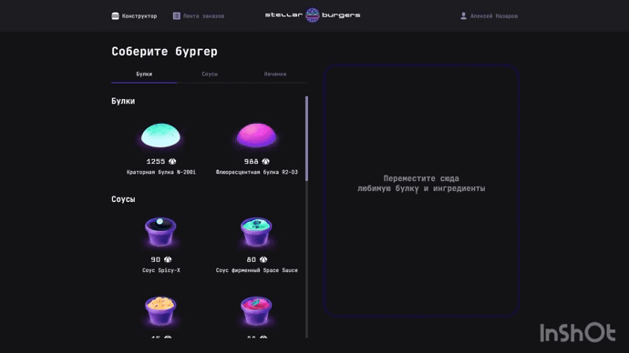

# Проект Stellar-Burgers

[Посмотреть проект](https://ninja6228.github.io/Stellar-Burgers/)

## Описание
<!-- Проект "Stellar-Burgers" включает в себя веб-приложение, предоставляющее пользователю возможность собрать бургер, заказать и отслеживать статус готовности космических бургеров. 
Пользователь может создать аккаунт, собрать бургер из доступных инградиентов, добавить и удалить их из корзины,а также отслеживать историю своих заказов в личном кабинете или обшию историю заказов на отдельной странице. Сервер обрабатывает заказы, генерирует уникальный идентификатор доставки и отправляет клиенту обновления о статусе доставки, например, "Создан", "Готовится", "Выполнен".
Таким образом, проект "Космические бургеры" предоставляет удобный интерфейс для заказа космических бургеров, с использованием Redux для управления состоянием приложения и Web Socket для обеспечения связи с сервером и получения обновлений. -->

## Стек технологий
* TypeScript
* React
* Redux
* Redux-toolkit
* Web-Socket

## Ссылка на проект
[Click](https://ninja6228.github.io/Stellar-Burgers/)

## Запуск проекта
* Клонировать проект - `git clone https://github.com/ninja6228/Stellar-Burgers.git`
* Устанавливаем зависимости - `npm install`
* Запускаем проект - `npm start`
